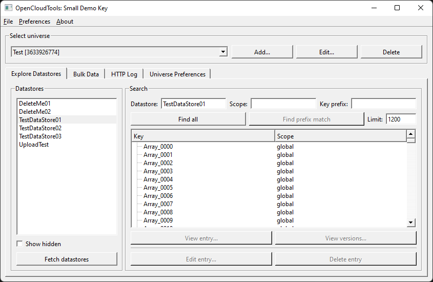
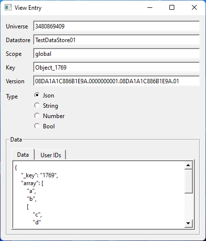
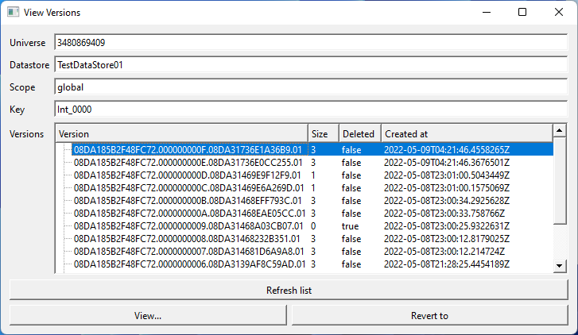
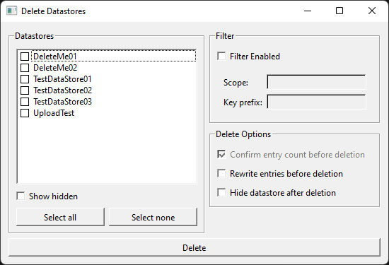

# Open Cloud Tools

Open Cloud Tools is a desktop application for Windows and MacOS that allows you to interact with Roblox's [Open Cloud](https://create.roblox.com/docs/open-cloud/index) API. Open Cloud Tools supports viewing, editing, reverting, bulk downloading, bulk deleting, and much more.

## Screenshots

## Features

### Basic Datastore Operations

* List datastores
* List datastore entries
* View entries
* View entry version history
  * View or revert to old versions
* Edit entries
* Delete entries

### Advanced Datastore Operations

* Bulk Download
  * Dump all of the entries in one or more datastores to a sqlite database. This data can later be uploaded through the 'Bulk Upload' operation.
* Bulk Delete
  * Delete all of the entries in one or more datastores.
* Bulk Undelete
  * Scan one or more datastores for deleted entries and restore their previous version.
* Bulk Upload
  * Upload a sqlite datastore dump. This can be used to restore from a backup or transfer data from one universe to another.

## Creating an API Key

To create an API key, go to the [Credentials page of the Roblox Creator Dashboard](https://create.roblox.com/credentials) and click the "Create API Key" button.

### DataStore Access Permissions

The bare minimum permissions that the key will need to list and view entries are:
* List Datastores
* List Entry Keys
* Read Entry

A read-only key can also optionally include:
* List Versions
* Read Version

The remaining permissions all allow modifying the datastore and you should give them out as needed:
* Create Datastore
* Create Entry
* Update Entry
* Delete Entry

## Building

A CMake build file is provided. This project requires C++17 to build.

### Dependencies

This project depends on SQLite and Qt 5/6. A recent version of SQLite is bundled in this repository, you have to provide your own Qt.

### Supported Platforms

This program can probably build and run on any platform that supports Qt 5 or 6, but has only been tested in the following configurations:
* Qt 6.3.1 and OpenCloudTools both built with Visual Studio 2022.
* Qt 5.15.5 with Visual Studio 2019 and OpenCloudTools built with Visual Studio 2022.
* Qt 6.3.1 and OpenCloudTools both built with XCode 13.2.1

## License

This program is available under the GPLv3 License. See the [LICENSE](./LICENSE) file for the full text of this license.
