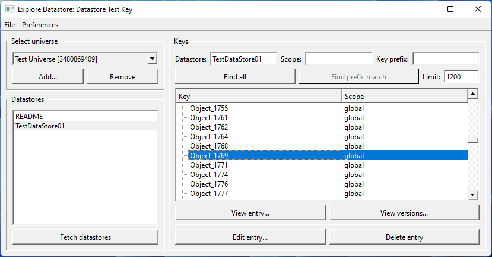
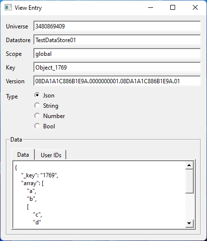
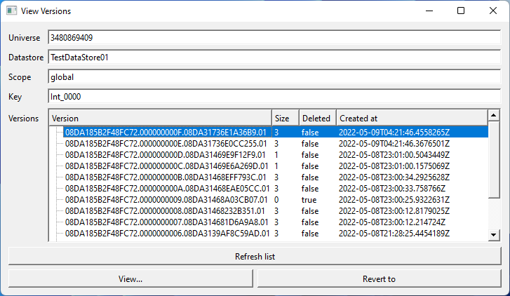

# Open Cloud Tools
Open Cloud Tools is a program for interacting with Roblox's [Open Cloud](https://create.roblox.com/docs/open-cloud/index) API.

Currently supported APIs:
* DataStore

## Screenshots

## Creating an API Key
To create an API key, go to the [Credentials page of the Creator Dashboard](https://create.roblox.com/credentials) and click the "Create API Key" button.

### DataStore Access Permissions

To use the DataStore API, add the following permissions:
* API System: DataStore
* Operations
  * Read Entry
  * Update Entry*
  * Delete Entry*
  * List Entry Keys
  * Read Version
  * List Versions
  * List DataStores

It is possible to omit the permissions marked with a * to create a read-only API key.

## Building

This project depends on Qt 6 and nothing else. Qt must be configured to support TLS. A CMake build file is provided.

Tested with MSVC 2022 and Qt 6.3.0. It will probably work with other compilers and Qt versions but I haven't tried any.

## License

This program is available under the GPLv3 License. See the [LICENSE](./LICENSE) file for the full text of this license.
