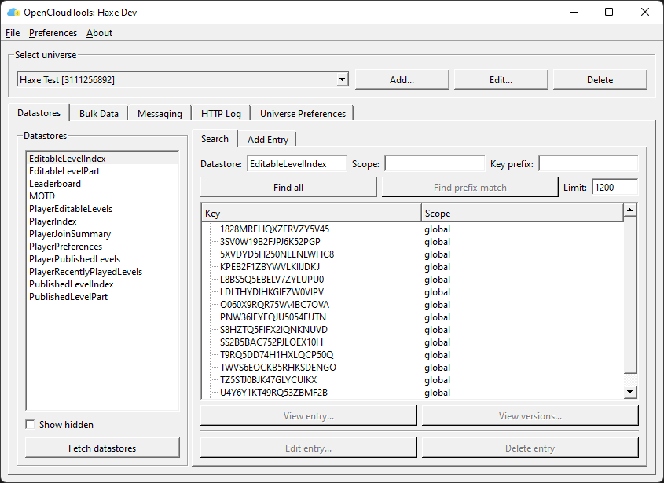
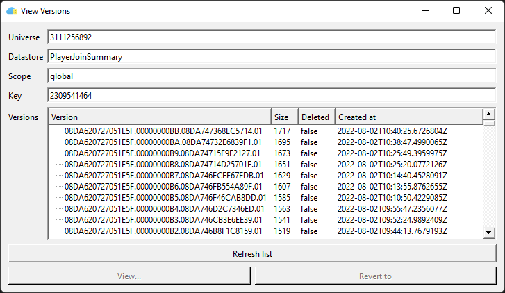
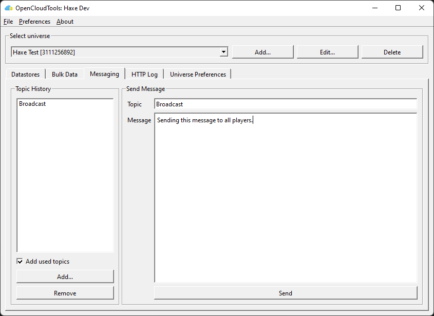

# Open Cloud Tools

Open Cloud Tools is a desktop application for Windows and MacOS that allows you to interact with Roblox's [Open Cloud](https://create.roblox.com/docs/cloud/open-cloud) API. Open Cloud Tools supports the Datastore, Ordered Datastore, and MessagingService APIs.

Icon by Roblox user [Loominatrx](https://devforum.roblox.com/u/loominatrx/summary).

## Screenshots

## Features

### Memory Store

Sorted maps are currently the only supported type of memory store data. Queue support coming soon.

#### Sorted Maps

Read data in order from a [Memory Store Sorted Map](https://create.roblox.com/docs/cloud-services/memory-stores/sorted-map). Write support coming soon.

### Messaging Service

Send messages that your game servers can consume using [MessagingService](https://create.roblox.com/docs/cloud-services/cross-server-messaging).

### Datastore Operations

Store and retrieve data using Roblox's [Datastores](https://create.roblox.com/docs/cloud-services/datastores).

#### Basic Datastore Operations

* List datastores
* List datastore entries
* View entries
* View entry version history
  * View or revert to old versions
* Edit entries
* Delete entries

#### Advanced Datastore Operations

* [Bulk Download](./doc/bulk_download.md)
  * Dump all of the entries in one or more datastores to a sqlite database. This data can later be uploaded through the 'Bulk Upload' operation.
  * Large downloads can be stopped and resumed later.
* Bulk Delete
  * Delete all of the entries in one or more datastores.
* Bulk Undelete
  * Scan one or more datastores for deleted entries and restore their previous version.
* Bulk Upload
  * Upload a sqlite datastore dump. This can be used to restore from a backup or transfer data from one universe to another.

### Ordered Datastore Operations

Retrive data using Roblox's [Datastores](https://create.roblox.com/docs/cloud-services/datastores).

* List all keys in ascending or descending order.
* Write support coming Soon™.

## Creating an API Key

To create an API key, go to the [Open Cloud API Keys page of the Roblox Creator Dashboard](https://create.roblox.com/dashboard/credentials) and click the "Create API Key" button.

### Memory Store

No top-level memory store permissions are supported yet.

#### Sorted Map

These are self-explanatory:
* `memory-store.sorted-map:read`
* `memory-store.sorted-map:write`

OpenCloudTools does not currently use the `write` permission for anything.

### Messaging Permissions (messaging-service)

The only permission available for Messaging is `publish`, which is required to send messages.

### Datastore Permissions (universe-datastores)

The bare minimum permissions that the key will need to list and view entries are:
* `universe-datastores.control:list` - List datastores
* `universe-datastores.objects:list` - List entries
* `universe-datastores.objects:read` - Read entries

A read-only key can also optionally include:
* `universe-datastores.versions:list` - List versions
* `universe-datastores.versions:read` - Read version

The remaining permissions all allow modifying the datastore and you should give them out as needed:
* `universe-datastores.control:create` - Create datastore
* `universe-datastores.objects:create` - Create entry
* `universe-datastores.objects:update` - Update entry
* `universe-datastores.objects:delete` - Delete entry

### Ordered Datastore Permissions (ordered-data-stores)

The only permissions that exist for Ordered Datastores are:
* `universe.ordered-data-store.scope.entry:read`
* `universe.ordered-data-store.scope.entry:write`

## Building

This project uses CMake and requires a compiler that supports C++17.

CMake presets are provided in the repo, to use these just edit `CMakeUserPresets.json` and update the relevant `CMAKE_PREFIX_PATH` variables to point at your own Qt installation. If Qt is on your default path you can delete the `CMAKE_PREFIX_PATH` lines entirely or just use the *-raw presets which do not have a prefix path set.

### Dependencies

This project depends on SQLite and Qt 5/6. A recent version of SQLite is bundled in this repository, you have to provide your own Qt.

Instructions on how Qt is built for the binary distributions are available in [doc/building_qt.md](./doc/building_qt.md).

### Supported Platforms

This program can probably build and run on any platform that supports Qt 5 or 6, but has only been tested in the following configurations that are used to build the binary distributions:

| Platform    | Qt Version | Compiler            |
|-------------|------------|---------------------|
| MacOS       | 6.5.3      | XCode 13.2.1        |
| Windows Qt5 | 5.15.16    | Visual Studio 2022* |
| Windows Qt6 | 6.8.1      | Visual Studio 2022  |

\*For Qt5, OpenCloudTools itself is built with VS 2022, but Qt is built with VS 2019.

## License

This program is available under the GPLv3 License. See the [LICENSE](./LICENSE) file for the full text of this license.
